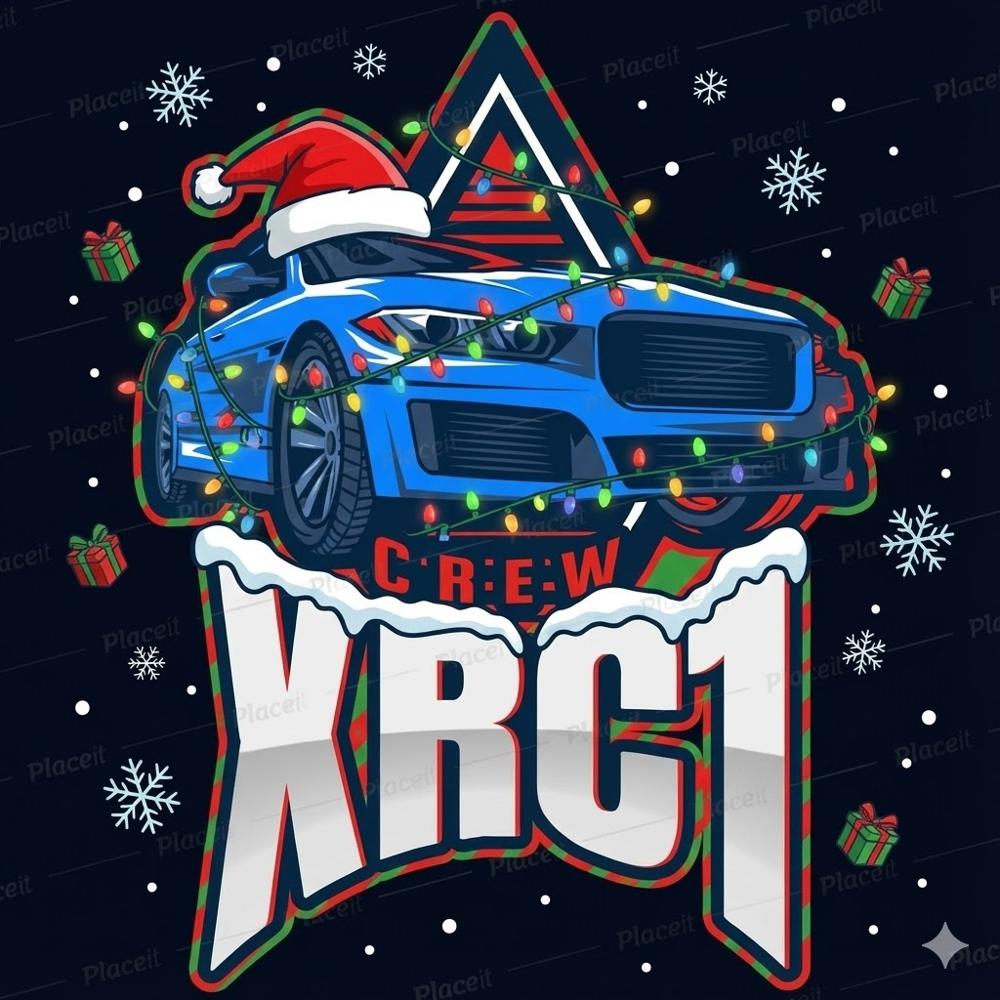

# 🎮 XRC1 Crew - Mod Installer

<div align="center">



**Instalador oficial del Modpack XRC1 para Minecraft 1.20.1**

[⬇️ Descargar Instalador](#-descarga) • [📖 Cómo Usar](#-c%C3%B3mo-usar) • [❓ Ayuda](#-preguntas-frecuentes)

</div>

---

## 🎯 ¿Qué es esto?

El **XRC1 Mod Installer** es una aplicación que instala automáticamente todos los mods del crew XRC1 en tu Minecraft.

### ✨ Características

- ⚡ **Instalación automática** - Solo selecciona tu carpeta y listo
- 🔄 **Actualización inteligente** - Detecta qué mods te faltan y descarga solo esos
- 📦 **98 mods incluidos** - Todo el modpack del servidor XRC1
- 🔥 **Descarga de Forge** - Incluye el instalador de Forge 1.20.1
- 🎨 **Interfaz moderna** - Diseño exclusivo con temática XRC1
- 🌐 **Siempre actualizado** - Se conecta automáticamente a GitHub para obtener los últimos mods

---

## ⬇️ Descarga

### [📥 Descargar XRC1 Mod Installer v1.0.0](https://github.com/TU_USUARIO/TU_REPO/releases/latest)

**Requisitos:**
- Windows 10/11
- Minecraft Java Edition instalado
- Conexión a Internet

---

## 📖 Cómo Usar

### 1️⃣ Descarga e Instala

1. Descarga `XRC1-Mod-Installer-Setup.exe` desde el enlace de arriba
2. Ejecuta el instalador
3. Si Windows SmartScreen aparece, haz clic en "Más información" → "Ejecutar de todas formas"
4. Sigue el asistente de instalación

### 2️⃣ Ejecuta el Instalador

1. Abre **XRC1 Mod Installer** desde el escritorio o menú inicio
2. La aplicación se abrirá con una interfaz moderna de XRC1

### 3️⃣ Selecciona tu Carpeta de Minecraft

1. Haz clic en **"📁 SELECCIONAR CARPETA"**
2. Navega a tu carpeta `.minecraft`:
   - **Ubicación típica:** `C:\Users\TuNombre\AppData\Roaming\.minecraft`
   - **Tip:** Presiona `Windows + R`, escribe `%appdata%\.minecraft` y Enter
3. Selecciona la carpeta

### 4️⃣ Analiza tus Mods

El instalador automáticamente:
- ✅ Detecta cuántos mods ya tienes instalados
- 📥 Identifica cuáles te faltan
- 📊 Te muestra un resumen completo

### 5️⃣ Instala los Mods

**Si ya tienes algunos mods:**
- Haz clic en **"⚡ INSTALAR FALTANTES"** para descargar solo los que te faltan

**Si quieres reinstalar todo:**
- Haz clic en **"📦 REINSTALAR TODOS"** para descargar todos los mods desde cero

**Para Forge:**
- Haz clic en **"🔥 DESCARGAR FORGE"**
- Ejecuta el instalador de Forge que se descargó
- Selecciona "Install client" y sigue el asistente

### 6️⃣ ¡Juega!

1. Abre Minecraft Launcher
2. Selecciona el perfil **"forge-1.20.1-47.3.0"**
3. Haz clic en **Jugar**
4. ¡Disfruta del modpack XRC1!

---

## 🔄 Actualizar Mods

Cuando agreguemos mods nuevos al servidor:

1. Abre el **XRC1 Mod Installer** de nuevo
2. Selecciona tu carpeta `.minecraft`
3. El instalador detectará automáticamente los mods nuevos
4. Haz clic en **"⚡ INSTALAR FALTANTES"**
5. Solo descargará los mods que te falten

**¡Así de fácil!** No necesitas descargar nada manualmente.

---

## ❓ Preguntas Frecuentes

### ¿Dónde está mi carpeta .minecraft?

La ubicación estándar es:
```
C:\Users\TuNombre\AppData\Roaming\.minecraft
```

**Método rápido:**
1. Presiona `Windows + R`
2. Escribe: `%appdata%\.minecraft`
3. Presiona Enter

### ¿Necesito descargar los mods manualmente?

**No.** El instalador descarga todo automáticamente desde GitHub.

### ¿Puedo usar esto si ya tengo mods instalados?

**Sí.** El instalador detecta qué mods ya tienes y solo descarga los que faltan.

### ¿Se actualizan los mods automáticamente?

Cada vez que abras el instalador, se conecta a GitHub para verificar la lista actualizada de mods.

### Windows Defender bloqueó el instalador

Esto es normal para aplicaciones nuevas:
1. Haz clic en "Más información"
2. Haz clic en "Ejecutar de todas formas"
3. El instalador es seguro, está creado por el XRC1 Crew

### ¿Qué hacer si falla la descarga de un mod?

1. Verifica tu conexión a Internet
2. Haz clic en **"🔄 VOLVER A ANALIZAR"**
3. Intenta instalar de nuevo
4. Si persiste, contacta al crew en Discord

### ¿Puedo usar el instalador sin conexión?

**No.** El instalador necesita Internet para:
- Obtener la lista de mods desde GitHub
- Descargar los archivos .jar

### ¿Funciona en Mac o Linux?

Por ahora solo Windows. Estamos trabajando en versiones para otros sistemas.

### ¿Los mods son compatibles entre sí?

**Sí.** Todos los mods han sido probados y funcionan juntos en el servidor XRC1.

---

## 🎮 Lista de Mods Incluidos

El modpack incluye **98 mods** cuidadosamente seleccionados:

- **Exploración:** Alex's Caves, Alex's Mobs, Ad Astra, Twilight Forest
- **Construcción:** Create, Chiseled and Bits, Another Furniture, CFM
- **Decoración:** Supplementaries, Cluttered, Chimes, Bells & Whistles
- **Optimización:** Embeddium, Oculus, FerriteCore, ModernFix
- **Calidad de vida:** JEI, JourneyMap, AppleSkin, Carry On
- **Generación:** Terralith, Tectonic, Better End Cities
- **Aventura:** Deeper Darker, Cataclysm, Boss es Rise
- **Y muchos más...**

---

## 🆘 Soporte

¿Necesitas ayuda?

- 💬 **Discord:** [discord.gg/xrc1crew](https://discord.gg/xrc1crew)
- 🐛 **Reportar problema:** [GitHub Issues](https://github.com/TU_USUARIO/TU_REPO/issues)
- 📺 **YouTube:** [youtube.com/@xrc1crew](https://youtube.com/@xrc1crew)

---

## 📜 Versión

**Versión actual:** 1.0.0
**Minecraft:** 1.20.1
**Forge:** 1.20.1-47.3.0
**Total de mods:** 98

---

## ⚠️ Nota Importante

Este instalador descarga mods desde nuestro repositorio de GitHub. Todos los mods son obtenidos de sus fuentes oficiales y redistribuidos con permiso según sus licencias.

---

<div align="center">

**Made with ❄️ by XRC1 Crew**

[🌐 Website](https://xrc1crew.com) • [💬 Discord](https://discord.gg/xrc1) • [📺 YouTube](https://youtube.com/@xrc1crew)

© 2024 XRC1 Crew. Todos los derechos reservados.

</div>
